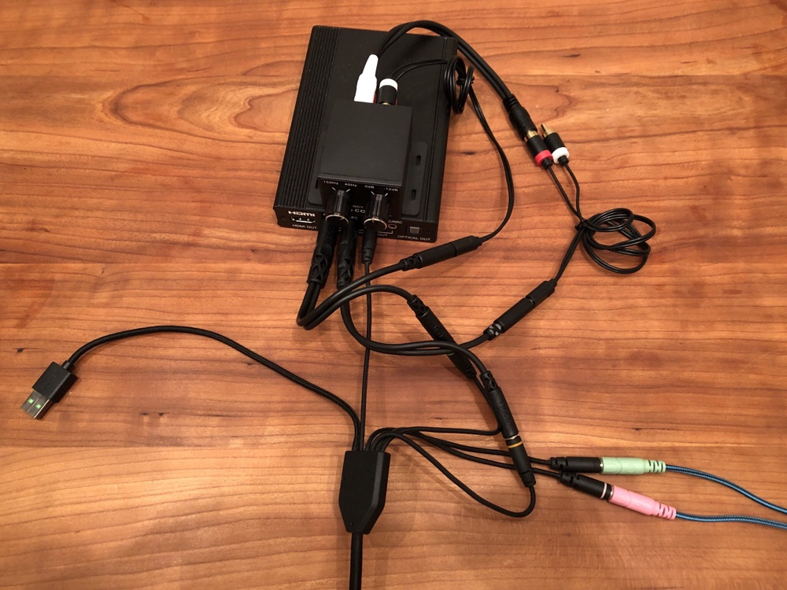
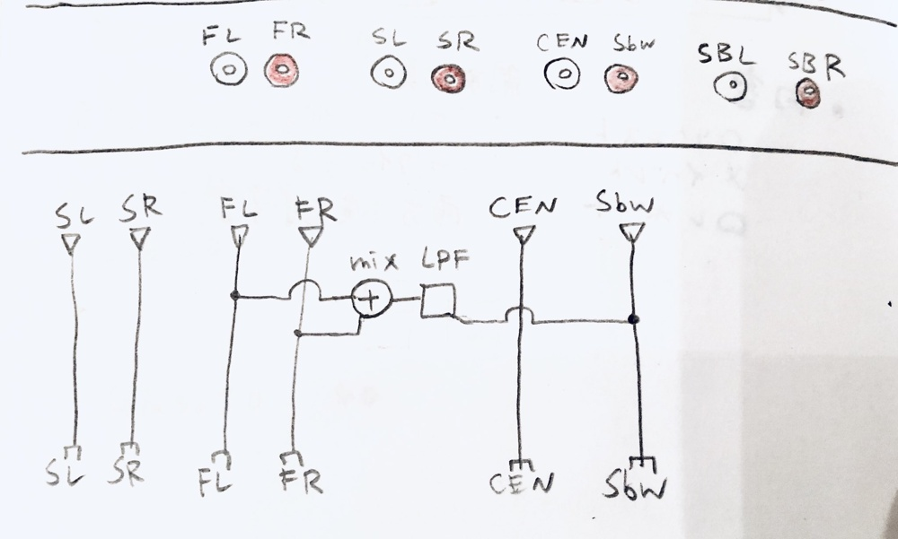

# Nintendo Switchサラウンド環境の作り方

[TOC]

## 目的

Nintendo Switchのゲーム音をヘッドホンからサラウンド再生する。

## 準備するもの

### 必須

* HDMIオーディオデコーダ 　Cypress Technology CLUX-11SA 
* HDMIケーブル

* ヘッドセット Razer Tiamat 7.1 V2

### バスリダイレクション（オプション）

バスリダイレクションに必要なもの

* ローパスフィルター (入出力がRSAのもの) 
* ステレオミニ オス-RSA
* モノラルミニオス-RSA
* ステレオミニ分岐ケーブル 2個

### 通話用（オプション）

* TRRSステレオミニ→TRS/マイク に変換するアダプタ (ケータイとつなげる)

## セットアップ

サラウンドの準備

### 配線
* HDMIケーブルの接続
   	Switch→HDMIデコーダ→TV

* ステレオミニプラグの接続
   	HDMIデコーダ→ヘッドセット
*  USB
   	ヘッドセット→Switch
   	TiamatはUSB充電器では動かないので注意。何がしかのコンピュータ (?) のUSB端子につなげる必要がある
   		例えば、SwitchのUSB端子の代わりにDVDプレイヤーのUSB端子に接続しても動いた

（2022/11/13追記）SwitchのUSB端子につないでも動かなかった。

### 設定と確認

* Switchのサウンド設定を変更する
   	サラウンド or 自動
* サラウンドになっているかを確認する
   	Switch本体のサウンドテスト
* 遊ぶゲームで確認
   		バスリダイレクト込みでテストするには、任意の場所で低音を鳴らせるゲームがわかりやすい。例えば、
      			ブレスオブザワイルドのバクダン
      			スプラトゥーン2のボム
* 各チャネルの音量を調整する

### バスリダイレクション

 低音を調整するには、バスリダイレクションのセットアップを行う。
Razer Tiamat 7.1 V2 x Nintendo Switch でバスリダイレクションを実現する配線の例を示す。

##### 繋げ方

* HDMIデコーダのfront出力を分岐して、片方はそのままヘッドホンのfrontチャネルと接続する
   もう片方はローパスフィルタに突っ込む
   	ローパス出力は、モノラルに変換して、ヘッドホンのサブウーファーへ合流する

* 接続後、ヘッドホンの各チャンネルのボリュームを再調整する。

### 通話

 通話しながらゲームするには、空いているチャンネル (Back) に通話音を入力し、マイクを接続する。

## Tips

### スピーカーとの切り替え

 Tiamatからスピーカーに切り替えて遊びたい場合は、Tiamatのライン出力端子を使うなり、SwitchにUSBオーディオをつなげるなり工夫する。